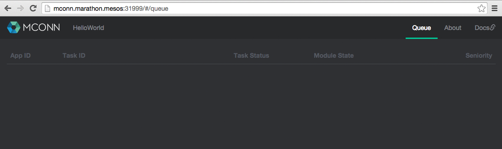
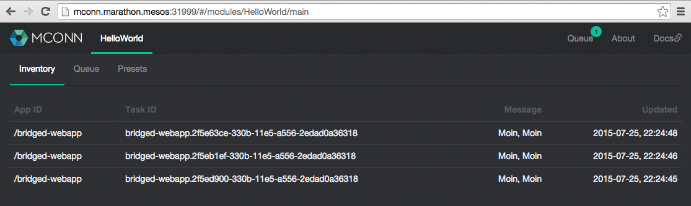

# [](https://github.com/datarhei/mconn) MConn

**Notice:**  
This is a pre-release for friends and colleagues to check code styles, functions and usability. Currently, MConn undergoes an intensive development and testing. We will release our first version 0.1.0 in the next weeks. Please stay tuned!

--

MConn is a HA JobQueue combined with a module management to work as an event-subscriber behind Mesosphere's [Marathon](https://github.com/mesosphere/marathon) to react on incoming task events and realize simple post processes (for Service-Discovery-Solutions) based on up/down scalings.

[](https://github.com/datarhei/mconn)

One of our targets has been a framework design that provides numerous custom post processes without wasting time on the individuell application of the Marathon-Handling, the HA and the fault-tolerance.

#### Features

* Web UI
* [JSON/Web API](docs/webapi.md)
* JobQueue 
 * API to react on incoming task events
 * Inventory sync. (timeevent or by leader-election) to work fault-tolerance
* Module-Management
* HA
 * *Zookeeper as datastore for states and module presets*
 * *Leader/Non-Leader election*
 * *request proxy to the current leader*

## For Developers

MConn is for free and based on the [Apache v2-License](LICENSE). Don’t hesitate to fork and customize it! We will release the required documentations with the upcoming version 0.1.0.

## Demo-Deployment

##### Requirements

* [Mesos](http://mesos.apache.org) (tested with 0.22.1)
* [Marathon](https://github.com/mesosphere/marathon) (tested with 0.8.1)
* [Mesos-DNS](https://github.com/mesosphere/mesos-dns) (tested with 0.1.2)
* [Docker](http://docker.com) (tested with 1.6.2)

You have to assure that Mesos-DNS and each hostname can also be reached by Mesos-Slaves.

##### MConn's default enviroments for a fast deployment (inspired by DCOS) are:

| Environment | Variable |
|------------|-----------|
| MCONN_HOST | ${HOST} |
| MCONN_PORT | ${PORT0} |
| MCONN_MODULE_PATH | ${MESOS_SANDBOX} |
| MCONN_MARATHON_HOSTS | leader.mesos:8080 |
| ZK_HOSTS | leader.mesos:2181 |
| ZK_PATH | ${MARATHON_APP_ID} |

You can modify this with the following Marathon-Config:

```json
"env": {
    "MCONN_MARATHON_HOSTS": "admin:password@leader.mesos:8080",
    "MCONN_ZK_HOSTS": "10.11.12.13:2181,10.11.12.14:2181,10.11.12.15:2181"
}
```
*Notice: MConn currently supports just one Marathon-Address*

### Start MConn incl. the [HelloWorld-Example](https://github.com/livespotting/mconn-helloworld):

The "uris"-paramenter in the following Marathon-Config will instruct Mesos to download the HelloWorkd-Example and extract it into the MESOS-SANDBOX:
 
```sh
curl -X POST -H "Accept: application/json" -H "Content-Type: application/json" \
    leader.mesos:8080/v2/apps -d '{
    "id": "mconn",
    "container": {
        "type": "DOCKER",
        "docker": {
            "image": "livespotting/mconn:0.0.5",
            "network": "HOST"
        },
        "volumes": []
    },
    "ports": [31999],
    "cpus": 1,
    "mem": 1024,
    "instances": 3,
    "healthChecks": [
        {
            "path": "/",
            "portIndex": 0,
            "protocol": "HTTP",
            "gracePeriodSeconds": 30,
            "intervalSeconds": 30,
            "timeoutSeconds": 30,
            "maxConsecutiveFailures": 3
        }
    ],
    "uris": [
        "https://github.com/livespotting/mconn-helloworld/archive/master.zip"
    ],
    "env": {
        "MCONN_MODULE_START": "mconn-helloworld-master"
    },
    "upgradeStrategy": {
        "minimumHealthCapacity": 0.5,
        "maximumOverCapacity": 0.0
    },
    "constraints": [
        [
            "hostname",
            "UNIQUE"
        ]
    ]
}'
```

After that call up the MConn UI at [mconn.marathon.mesos:31999](http://mconn.marathon.mesos:31999) (or get it from the Marathon UI)

[](https://github.com/datarhei/mconn)

### Add MConn as a Marathon Event-Subscriber:

To expand the "event_subscriber" on Marathon, start Marathon with "--event_subscriber http_callback" (more [here](https://mesosphere.github.io/marathon/docs/command-line-flags.html)) and afterwards install MConn as a HTTP-Endpoint:

```sh
curl -X POST leader.mesos:8080/v2/eventSubscriptions?callbackUrl=http://mconn.marathon.mesos:31999/jobqueue
```
### Start a Demo-Application:

First you have to add a preset for the HelloWorld-Module instructing the modul what to do with our demo-app:

```sh
curl -H "Content-Type: application/json" -X POST -d '{"appId":"bridged-webapp","moduleName":"HelloWorld","status":"enabled","options":{"actions":{"add":"Moin, Moin","remove":"Tschues"}}}' http://mconn.marathon.mesos:31999/v1/module/preset
```
The preset will generate a "Moin, Moin" if a task has got the status quo "TASK_RUNNING". It will generate a "Tschues", if the task is "TASK_FINISHED", "TASK_KILLED" or "TASK_FAILED".

[](https://github.com/datarhei/mconn)

Afterwards start the Demo-APP to see how the MConn-JobQueue-Management will work:

```sh
curl -X POST -H "Accept: application/json" -H "Content-Type: application/json" \
    leader.mesos:8080/v2/apps -d '{
    "id": "bridged-webapp",
    "cmd": "python3 -m http.server 8080",
    "cpus": 0.5,
    "mem": 64,
    "instances": 4,
    "container": {
        "type": "DOCKER",
        "docker": {
            "image": "python:3",
            "network": "BRIDGE",
            "portMappings": [
                {
                    "containerPort": 8080,
                    "hostPort": 0,
                    "protocol": "tcp"
                },
                {
                    "containerPort": 161,
                    "hostPort": 0,
                    "protocol": "udp"
                }
            ]
        }
    },
    "healthChecks": [
        {
            "protocol": "HTTP",
            "portIndex": 0,
            "path": "/",
            "gracePeriodSeconds": 5,
            "intervalSeconds": 20,
            "maxConsecutiveFailures": 3
        }
    ]
}'
```
[](https://github.com/datarhei/mconn)

## Author / Contributors

Livespotting Media GmbH  
* Christoph Johannsdotter
* Jan Stabenow

## License

Apache License  
Version 2.0, January 2004  
http://www.apache.org/licenses/  
