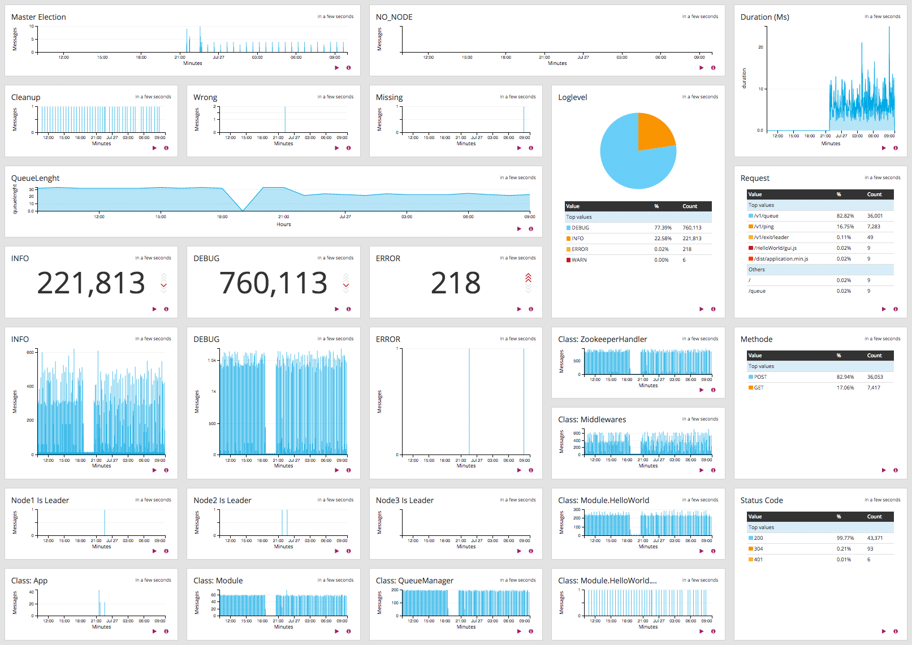

## Logging

### Logging-Levels

For more information see the [MCONN_LOGGER_LEVEL](enviroments.md#mconn_logger_level) description.

### Graylog-Dashboard Example

[](https://github.com/datarhei/mconn)

### Logstash-Example

Shipper.conf:
```sh
input {
  file {
    type => "mconn"
    path => ["/tmp/mesos/slaves/*/frameworks/*/executors/mconn.*/runs/latest/stdout"]
    tags => "mconn.marathon.mesos"
  }
}
filter {
  if [type] == "mconn" {
    grok {
      patterns_dir => [ "/etc/logstash/patterns" ]
      match => [ "message", "%{COMBINED_MCONN_1}" ]
      match => [ "message", "%{COMBINED_MCONN_2}" ]
      match => [ "message", "%{COMBINED_MCONN_3}" ]
      overwrite => [ "message" ]
    }
  }
}
output {
  gelf {
    host => "graylog.marathon.mesos"
    port => 31852
  }
}
```
Pattern:
```sh
MCONN_CUSTOM [^;]*
MCONN_TIMESTAMP %{MONTHDAY}-%{MONTHNUM}-%{YEAR} %{HOUR}:%{MINUTE}:%{SECOND}
COMBINED_MCONN_1 \[%{MCONN_TIMESTAMP:timestamp}] \[%{LOGLEVEL:loglevel}] %{MCONN_CUSTOM:message} Now "%{NUMBER:queuelenght:float}" tasks in queue (%{MCONN_CUSTOM:class})?
COMBINED_MCONN_2 \[%{MCONN_TIMESTAMP:timestamp}] \[%{LOGLEVEL:loglevel}] %{WORD:method} "%{MCONN_CUSTOM:request}" %{NUMBER:status} %{NUMBER:duration:int} %{IP:client} (%{MCONN_CUSTOM:class})?
COMBINED_MCONN_3 \[%{MCONN_TIMESTAMP:timestamp}] \[%{LOGLEVEL:loglevel}] %{MCONN_CUSTOM:message} (%{MCONN_CUSTOM:class})?
```
